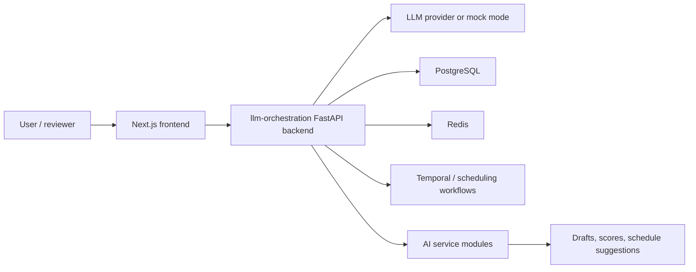

# AI Social Media Manager

AI-powered social media workspace for planning, generating, reviewing, scheduling, and optimizing multi-platform content.

## Overview

AI Social Media Manager, also referred to as ARIA in the codebase, is a product-style AI application for content operations. It combines a Next.js frontend, Python/TypeScript service packages, LLM-assisted generation workflows, approval-oriented UX, scheduling logic, and deployment documentation.

The project is structured as a full-stack prototype rather than a single prompt demo. It includes frontend flows, API contracts, service modules, Docker Compose infrastructure, environment examples, and phase-by-phase implementation notes.

## Problem

Social media workflows often spread strategy, copywriting, review, scheduling, and analytics across separate tools. This project explores a unified AI-assisted workspace where generated content remains constrained by brand rules, review states, platform context, and deterministic workflow logic.

## Features

- Guided content-generation workflow for topic, platform, draft, review, refinement, and scheduling steps
- Brand-aware AI generation through the canonical llm-orchestration backend, with explicit mock mode
- Approval queue and review-oriented frontend UX
- Scheduling and time-optimization service modules
- Content-analysis, caption-generation, hashtag/SEO, visual-understanding, and audience-targeting service areas
- Docker Compose stack for local infrastructure including Postgres, Redis, Kafka, and Temporal
- Vercel frontend, Render backend, and Supabase database/auth-aligned storage path for the MVP
- Architecture, API contract, verification, and phase-summary documentation

## Tech Stack

| Layer | Technologies |
| --- | --- |
| Frontend | Next.js, React, TypeScript, Tailwind CSS, Radix UI |
| Backend / Services | Python, FastAPI-style service modules, TypeScript API package |
| AI / LLM | Python llm-orchestration gateway, backend-only OpenAI-compatible provider configuration, explicit mock mode, prompt templates |
| Data / Infra | PostgreSQL, Redis, Kafka, Temporal, Docker Compose |
| Tooling | pnpm, npm, Turbo, Prisma, GitHub Actions |

## Architecture

The repository contains two major application areas:

- `aria-frontend/`: canonical Next.js frontend used for the product UI.
- `aria/`: monorepo-style service workspace with API, dashboard, AI service packages, typed contracts, database package, and orchestration-related modules.
- `aria/apps/llm-orchestration/`: canonical FastAPI AI orchestration backend for generation, Brand Brain, approval, and workspace APIs.

The root-level `apps/` and `packages/` folders contain earlier or extracted Python service modules for content analysis, visual understanding, hashtag/SEO, scheduling, time optimization, caption generation, and prompt/decision logic.



## Project Structure

```text
.
  aria-frontend/        Canonical Next.js frontend
  aria/                 Monorepo workspace for API, dashboard, packages, and service modules
  apps/                 Python AI service modules
  packages/             Shared Python packages and prompt/type assets
  docs/                 Architecture and product documentation
  .github/workflows/    CI and legacy/static-demo workflow history
  docker-compose.yml    Local infrastructure stack
  .env.example          Root environment example
```

## Getting Started

### Frontend

```bash
cd aria-frontend
npm install
npm run dev
```

Build and type-check the frontend:

```bash
cd aria-frontend
npm run typecheck
npm run build
```

### ARIA Monorepo

The `aria/` workspace declares pnpm/Turbo scripts:

```bash
cd aria
pnpm install
pnpm dev
pnpm build
pnpm lint
pnpm typecheck
pnpm test
```

### Local Infrastructure

```bash
cp .env.example .env
docker compose up --build
```

The root Compose file starts local infrastructure and service containers. Review `.env.example` before running and replace placeholder values with local-only credentials.

## Environment Variables

Environment examples are included at:

- `.env.example`
- `aria/.env.example`
- `aria-frontend/.env.example`

Important variables include:

| Variable | Purpose |
| --- | --- |
| `DATABASE_URL` | PostgreSQL connection string |
| `REDIS_URL` | Redis connection string |
| `OPENAI_API_KEY` | Backend-only optional provider key for non-mock AI generation |
| `OPENAI_MODEL` | Model name for OpenAI-compatible calls |
| `AI_MOCK_MODE` | Enables deterministic/mock AI behavior for local development |
| `NEXT_PUBLIC_API_BASE_URL` | Canonical browser-visible public API base URL for the Render/FastAPI backend |
| `TEMPORAL_ADDRESS` | Temporal service address for workflow-oriented components |

All active frontend API clients use `NEXT_PUBLIC_API_BASE_URL`. Legacy public API aliases are no longer read by the canonical runtime.

Do not commit real secrets. Keep real values in local `.env` files or deployment secret stores.

## Scripts

| Location | Command | Purpose |
| --- | --- | --- |
| `aria-frontend/` | `npm run dev` | Start frontend development server |
| `aria-frontend/` | `npm run build` | Build the frontend |
| `aria-frontend/` | `npm run typecheck` | Run TypeScript checks |
| `aria/` | `pnpm dev` | Run monorepo dev tasks with Turbo |
| `aria/` | `pnpm build` | Run monorepo build tasks |
| `aria/` | `pnpm test` | Run configured tests |
| root | `docker compose up --build` | Start local infrastructure/services |

## Documentation

- [Canonical architecture](docs/architecture/CANONICAL_ARCHITECTURE.md)
- [ARIA baseline report](docs/audits/ARIA_BASELINE_REPORT.md)
- [Verification report](docs/testing/VERIFICATION_REPORT.md)
- [Full system architecture](docs/full-system-architecture.md)
- [Local run guide](LOCAL_RUN_GUIDE.md)
- [AI architecture](AI_ARCHITECTURE.md)
- [API contracts](PHASE_4_API_CONTRACTS.md)
- Phase implementation and verification summaries are retained for auditability.

## Screenshots

No screenshot assets were found in the repository root documentation. Add screenshots or a short demo video once the hosted frontend flow is stable.

## Status

Status: Active product-style MVP / prototype.

The canonical MVP path is `aria-frontend` on Vercel, `aria/apps/llm-orchestration` on Render, and Supabase for database/auth-aligned storage. The repository contains substantial implementation and documentation, but it should not be described as production-ready until deployment, authentication, monitoring, data persistence, and external service behavior are verified end to end.

## Roadmap

- Consolidate duplicated root-level and `aria/` service structures where possible
- Add screenshot/demo assets to the README
- Keep only CI workflows that match the current app structure
- Continue removing duplicate legacy dashboard routes after each redirect is verified
- Add lightweight smoke tests for the public demo build

## Known Limitations

- Some services depend on local infrastructure or placeholder environment values.
- Legacy frontend provider routes return `410`; normal product flows must use the llm-orchestration backend.
- Hosted static output can only demonstrate the frontend/static path, not the full backend stack.
- Several phase-summary documents are useful for audit history but make the root directory noisy.
- Real social platform publishing credentials and production deployment details are not included.

## License

This repository includes an MIT-style [LICENSE](LICENSE).
