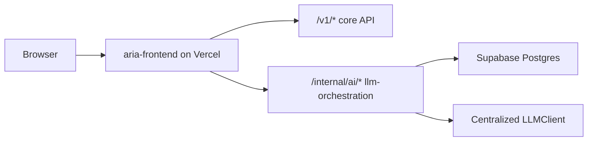
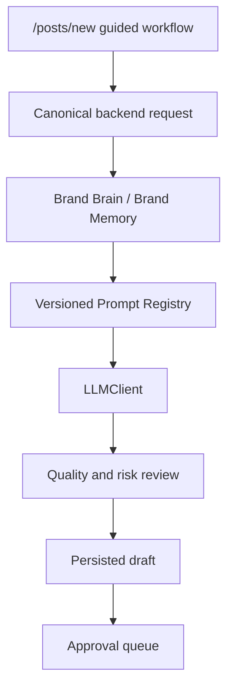
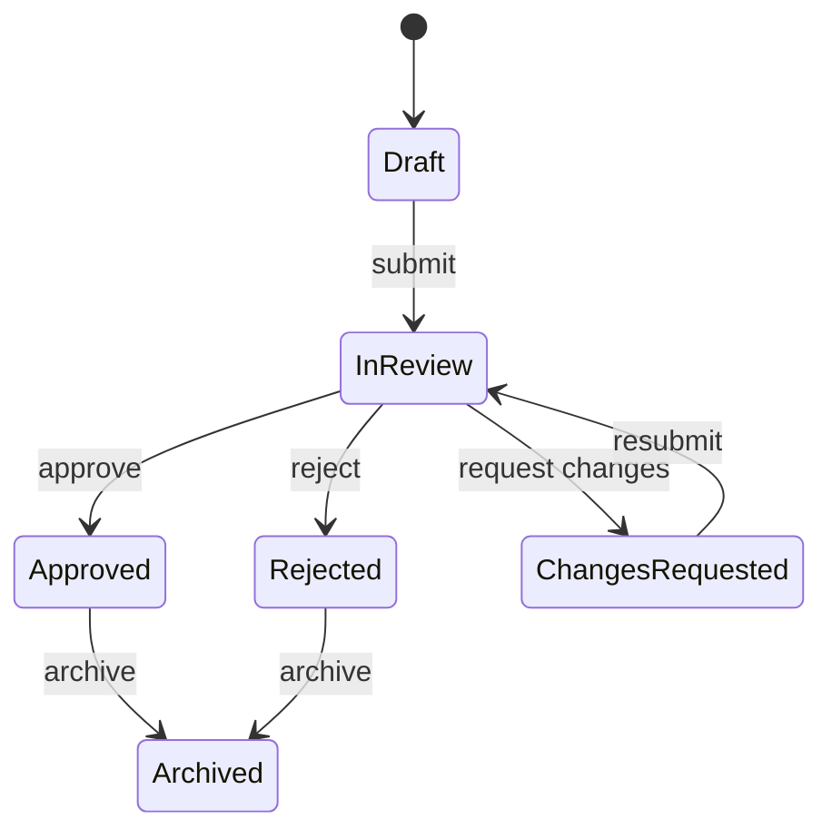
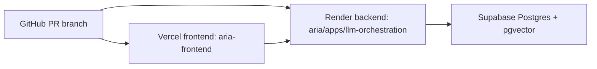
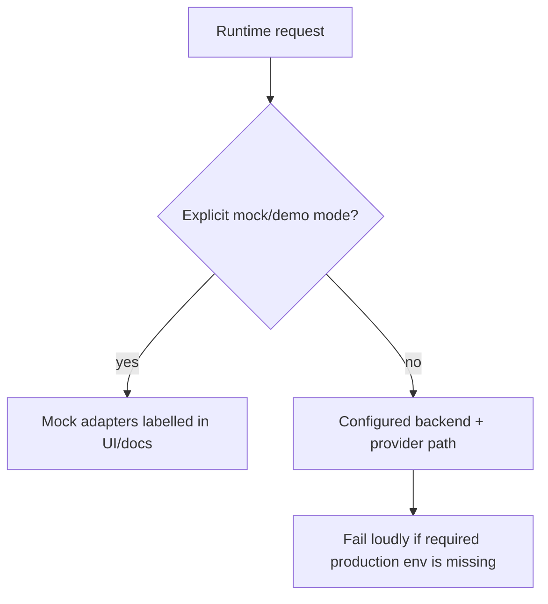

# Canonical ARIA Architecture

## Product Boundary

ARIA is an approval-based AI social media manager and brand manager. The MVP must distinguish generated drafts, internal planning, approval, scheduling readiness, and real external publishing.

## Canonical Runtime Paths

- Frontend: `aria-frontend`
- AI orchestration backend: `aria/apps/llm-orchestration`
- Primary content-generation flow: `/posts/new` in the role-aware frontend shell
- Primary content API: `/v1/posts/generate`
- AI workspace API: `/internal/ai/*` on the llm-orchestration backend
- Approval UI: `/dashboard/approval`
- Deployment path: Vercel frontend, Render backend, Supabase database/auth-aligned storage

## Retired Normal-Flow Paths

The frontend no longer executes direct provider calls from Next.js route handlers for normal product flows.

- `/api/generate` now returns `410`.
- `/api/ai/generate-content` now returns `410`.
- `/api/ai/generate-batch` now returns `410`.
- `/api/ai/improve-content` now returns `410`.
- `/api/ai/analyze-content` now returns `410`.
- `/api/ai/suggest-hashtags` now returns `410`.
- `/api/ai/suggest-topics` now returns `410`.

These routes remain as explicit compatibility tombstones so accidental consumers fail loudly instead of silently calling OpenAI or Anthropic from the frontend.

## Navigation Decisions

Primary navigation is converging to:

1. Overview
2. Brand Brain
3. Create
4. Content
5. Calendar
6. Approval
7. Insights
8. Settings

Mobile navigation is capped at five destinations: Overview, Create, Content, Approval, More.

The single frontend navigation source is `aria-frontend/lib/navigation.ts`. Role-aware shell navigation, legacy dashboard sidebar navigation, mobile navigation, route matching, and login redirects must derive from this module rather than local route arrays.

## Architecture Flows

### Browser Request Flow

### Content Generation Flow

### Approval Lifecycle

Approved content is not the same as externally published content. Ready for scheduling is not the same as an external platform schedule.

### Deployment Topology

### Demo And Mock Boundary

## Remaining Consolidation Work

- Legacy `/dashboard/*` module pages still exist and need route-by-route retirement or migration after behavior is verified.
- Root-level `apps/` and `packages/` still overlap with `aria/apps/` and `aria/packages/`.
- Frontend contracts are still handwritten and should be synchronized from the FastAPI OpenAPI schema.
- Backend `main.py` still owns too much routing logic and should be split into routers and dependencies in a later phase.
