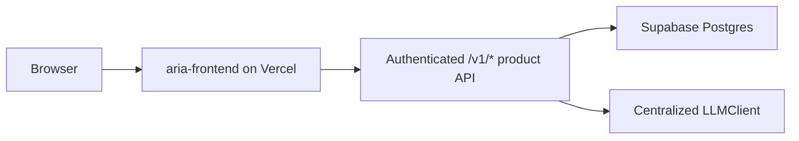
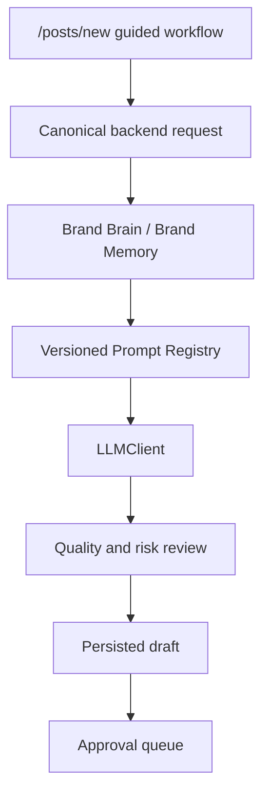
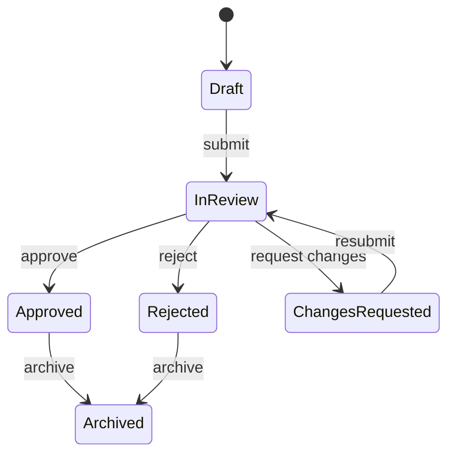
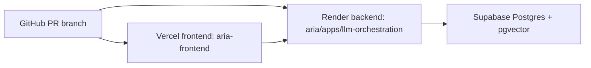
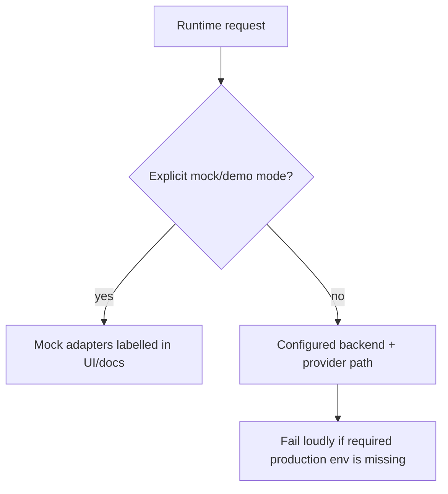

# Canonical ARIA Architecture

## Product Boundary

ARIA is an approval-based AI social media manager and brand manager. The MVP must distinguish generated drafts, internal planning, approval, scheduling readiness, and real external publishing.

## Canonical Runtime Paths

- Frontend: `aria-frontend`
- AI orchestration backend: `aria/apps/llm-orchestration`
- Browser public API base: `NEXT_PUBLIC_API_BASE_URL`
- Primary content-generation flow: `/posts/new` in the role-aware frontend shell
- Primary content API: `/v1/posts/generate`
- Public runtime router: `aria/apps/llm-orchestration/app/api/routers/public_runtime.py`
- Product API: authenticated, tenant-scoped `/v1/*` routes on the llm-orchestration backend
- Brand Brain API: `/v1/brands/{brand_id}/profile`
- Approval API: `/v1/approval/*`
- Approval UI: `/dashboard/approval`
- Deployment path: Vercel frontend, Render backend, Supabase database/auth-aligned storage

## Retired Normal-Flow Paths

The frontend no longer executes direct provider calls from Next.js route handlers for normal product flows.

- `/api/generate` now returns `410`.
- `/api/ai/generate-content` now returns `410`.
- `/api/ai/generate-batch` now returns `410`.
- `/api/ai/improve-content` now returns `410`.
- `/api/ai/analyze-content` now returns `410`.
- `/api/ai/suggest-hashtags` now returns `410`.
- `/api/ai/suggest-topics` now returns `410`.

These routes remain as explicit compatibility tombstones so accidental consumers fail loudly instead of silently calling OpenAI or Anthropic from the frontend.

## Navigation Decisions

Primary navigation is converging to:

1. Overview
2. Brand Brain
3. Create
4. Content
5. Calendar
6. Approval
7. Insights
8. Settings

Mobile navigation is capped at five destinations: Overview, Create, Content, Approval, More.

The single frontend navigation source is `aria-frontend/lib/navigation.ts`. Role-aware shell navigation, legacy dashboard sidebar navigation, mobile navigation, route matching, and login redirects must derive from this module rather than local route arrays.

## Architecture Flows

### Browser Request Flow

### Content Generation Flow

### Approval Lifecycle

Approved content is not the same as externally published content. Ready for scheduling is not the same as an external platform schedule.

### Deployment Topology

### Demo And Mock Boundary

## Authentication And Tenant Boundary

- Next.js issues HS256 access tokens with required `sub`, `iss=aria-frontend`, `aud=aria-api`, `iat`, and `exp` claims.
- FastAPI verifies those claims and resolves the active role from `ai_workspace_memberships`; token role metadata is not authorization.
- Browser calls send `X-ARIA-Workspace-ID`. Every canonical repository query also filters by `workspace_id`.
- Registration creates the user, workspace, membership, and first brand in one database transaction.
- Direct Data API grants for the backend-owned `ai_*` tables are revoked from `anon` and `authenticated`.

## Shared Contracts

FastAPI OpenAPI is exported to `aria-frontend/openapi/aria.json`. `openapi-typescript` generates `aria-frontend/types/generated/aria-api.ts`. CI runs `npm run contracts:check` and fails on drift.

## Remaining Consolidation Work

- Legacy `/dashboard/*` module pages still exist and need route-by-route retirement or migration after behavior is verified.
- Root-level `apps/` and `packages/` still overlap with `aria/apps/` and `aria/packages/`.
- Secondary AI tools still use authenticated legacy `/internal/ai/*` routes. Production middleware verifies membership and matching brand context; approval and `/run` legacy paths return `410`.
- Backend `main.py` still owns secondary AI route declarations and can be reduced further after those tools receive canonical routers.
- Migration `010_pr9_backend_alignment.sql` is validated against live PostgreSQL but is not applied to the connected primary Supabase database from this branch.
